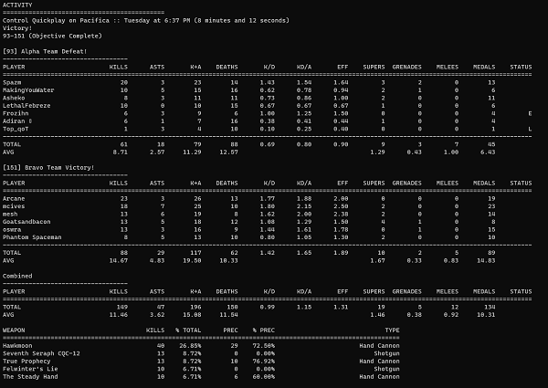

# dcliad

Command line tool for retrieving and viewing Destiny 2 Crucible activity / match details.

By default the details on the last activity will be displayed, with options (`--mode`) to specify the mode from which to retrieve the last activity.

You can also specify the specific activity via the `--activity-index` argument. The index can be retrieved from dcliah.

By default, the app will display summary data for the match, including each player and an overview of weapon usage. By passing in the `--details` flag, per user weapon usage and stats will be displayed.

dcliad pulls its data from the local Destiny 2 activity database store. Data can be synced using using [dclisync](https://github.com/mikechambers/dcli/tree/main/src/dclisync) or by passing the --sync flag to dcliad.

The tool expects that the manifest has been downloaded and synced using [dclim](https://github.com/mikechambers/dcli/tree/main/src/dclim).

[](../../images/dcliad.png)

## USAGE

```
USAGE:
    dcliad [FLAGS] [OPTIONS] --name <name>

FLAGS:
    -d, --details
            Display extended activity details

            If flag is set, additional information will be displayed, including per user weapon stats.
    -h, --help
            Prints help information

    -s, --sync
            Sync activities for specified user

    -V, --version
            Prints version information

    -v, --verbose
            Print out additional information

OPTIONS:
    -a, --activity-id <activity-id>
            The activity id of the activity to display data about

            By default, the last activity will be displayed. The index can be retrieved
    /// from other dcli apps, such as dcliah, or directly from the sqlite datastore.
            dcliah, or directly from the sqlite datastore.
    -k, --api-key <api-key>
            API key from Bungie required for some actions.

            If specified the key will be passed to all Destiny API calls.

            You can obtain a key from https://www.bungie.net/en/Application [env:
            DESTINY_API_KEY=8eacb6527ea648fbbd8106990231c21c]
    -C, --class <character-class-selection>
            Character class to retrieve data for

            Valid values include hunter, titan, warlock, last_active and all. [default: all]
    -D, --data-dir <data-dir>
            Directory where Destiny 2 manifest and activity database files are stored. (optional)

            This will normally be downloaded using the dclim tool, and uses a system appropriate directory by default.
    -M, --mode <mode>
            Activity mode from which to return last activity

            Supported values are all_pvp (default), control, clash, elimination, mayhem, iron_banner, all_private,
            rumble, pvp_competitive, quickplay and trials_of_osiris.

            Addition values available are crimsom_doubles, supremacy, survival, countdown, all_doubles, doubles,
            private_clash, private_control, private_survival, private_rumble, showdown_competitive, survival_competitive, rift_competitive, showdown, lockdown, scorched, rift, iron_banner_rift, zone_control, iron_banner_zone_control
            scorched_team, breakthrough, clash_quickplay, trials_of_the_nine, relic, countdown_competitive, checkmate_all, checkmate_control, checkmate_rumble, checkmate_survival, checkmate_rumble, checkmate_clash, checkmate_countdown, iron_banner_tribute [default: all_pvp]
    -n, --name <name>
            Bungie name for player

            Name must be in the format of NAME#CODE. Example: foo#3280 You can find your name in game, or on Bungie's
            site at: https://www.bungie.net/7/en/User/Account/IdentitySettings
    -w, --weapon-count <weapon-count>
            The number of weapons to display details for [default: 5]
```

| ARGUMENT | OPTIONS                                                                                                                                                                                                                                                                                                                                                                                                                                                                                                                                                                                                                                                                                            |
| -------- | -------------------------------------------------------------------------------------------------------------------------------------------------------------------------------------------------------------------------------------------------------------------------------------------------------------------------------------------------------------------------------------------------------------------------------------------------------------------------------------------------------------------------------------------------------------------------------------------------------------------------------------------------------------------------------------------------- |
| --mode   | all_pvp (default), control, clash, elimination, mayhem, iron_banner, all_private, rumble, pvp_competitive, quickplay and trials_of_osiris, crimsom_doubles, supremacy, survival, countdown, all_doubles, doubles private_clash, private_control, private_survival, private_rumble, showdown_competitive, survival_competitive, rift_competitive, showdown, lockdown, scorched, rift, iron_banner_rift, zone_control, iron_banner_zone_control, scorched_team, breakthrough, clash_quickplay, trials_of_the_nine, relic, countdown_competitive, checkmate_all, checkmate_control, checkmate_rumble, checkmate_survival, checkmate_rumble, checkmate_clash, checkmate_countdown, iron_banner_tribute |

Manifest can be downloaded and synced with from [dclim](https://github.com/mikechambers/dcli/tree/main/src/dclim).

Activity data store can be created and synced seperately using [dclisync](https://github.com/mikechambers/dcli/tree/main/src/dclisync).

**NOTE** : Currently, due to a [bug](https://github.com/Bungie-net/api/issues/1386) in the Destiny 2 API, you will only get results for private matches when specifying _all_private_. The other options are still included in case the bug is fixed. If viewing private match stats is important to you, please leave a comment [here](https://github.com/mikechambers/dcli/issues/10).

### Examples

#### View details for last activity played

```
$ dcliad --name mesh#3230
```

#### View details for last Iron Banner match played on hunter class

```
$ dcliad --name mesh#3230 --mode iron_banner --class hunter
```

#### View details for last activity played displaying extended details

```
$ dcliad --name mesh#3230 --details
```

#### View details for a specific activity via its index (retrieved from dcliah)

```
$ dcliad --name mesh#3230 --activity-index 7329
```

## Questions, Feature Requests, Feedback

If you have any questions, feature requests, need help, are running into issues, or just want to chat, join the [dcli Discord server](https://discord.gg/2Y8bV2Mq3p).

You can also log bugs and features requests on the [issues page](https://github.com/mikechambers/dcli/issues).

### Environment Variables

#### DCLI_FIX_DATA

If the `DCLI_FIX_DATA` environment variable is set to `TRUE` then when corrupt or missing data is returned from the Bungie API, and there is not a valid local version, DCLI will attempt to retrieve updated, non-corrupt data from Bungie. (This sometimes happens if a lot of people leave a game, and no player names will be returned from the server).

Setting this to true can significantly slow down sync time, especially the initial sync, and in general, is meant to be used when using DCLI to create datastores for larger applications.

#### RUST_LOG

All dcli apps have support for log output via the [env_logger](https://docs.rs/env_logger/0.9.3/env_logger/) library. This is mostly used for development, but may be helpful when trying to debug any issues.

## Compiling

This utility is written and compiled in [Rust](https://www.rust-lang.org/).

When compiling you must have an environment variable named `DESTINY_API_KEY` which contains your [Bungie API key](https://www.bungie.net/en/Application).

To compile, switch to the `src/` directory and run:

```
$ cargo build --release
```

which will place the compiled tools in _src/target/release_
